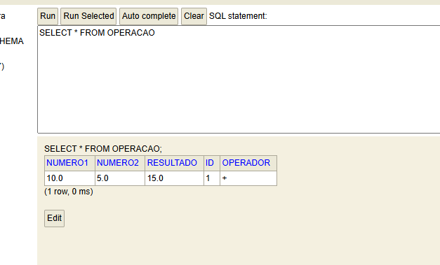

Projeto de Calculadora em JAVA

Criando do zero para praticar a linguagem java e se aperfeiçoar cada vez
mais na programação em backend

Testes usando o Postman

Testar usando o database H2-console

